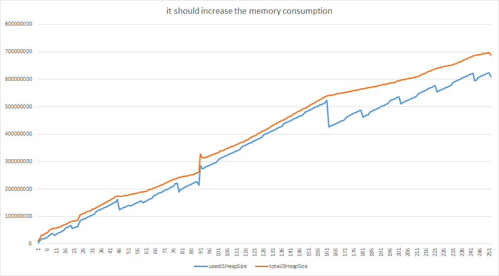

# HTML5 Protractor Tools Documentation - Memory Utils

In order to be able to use all methods this module offers, Google Chrome needs to be started with two additional parameters:

```
> chrome.exe --enable-precise-memory-info --js-flags="--expose-gc"
```

Omit the ".exe" when running on a non Windows machine.

Chrome provides the following values as part of the `window.performance.memory` object:

* jsHeapSizeLimit
* usedJSHeapSize
* totalJSHeapSize

Since these tests often need to run for a longer period of time (several minutes), the `it` function needs to be called with the optional second `timeout` parameter, since the default timeout for Protractor test cases is something like 30 seconds:

```
it('tests something', function () {    
   // Do something in here that can take a long time.
}, 1000000);
```

Memory utils may be used to generate `*.txt` log files and `*.csv` data files. The latter one may be used to visualize the memory usage of your app.
The following two graphs showcase the memory usage of the two example test cases available at [`example/test/e2e/memory.spec`](../example/test/e2e/memory.spec)




## Functions

### `runTestFunction(protractorTestInstance, iterations, testFn[, options])`

Allows to run a defined test function (`testFn`) a number of times (`iterations`) as part of a Protractor test (`protractorTestInstance`), tracking the memory usage after each call.

The optional `options` object has the following default values:

```
{
    initialPostGcSleep: 2500,
    finalPostTestSleep: 1500,
    finalPostGcSleep: 4500,
    writeLogFile: true,
    writeCsvFile: true
}
```

* `initialPostGcSleep`: Timeout in milliseconds after the initial garbage collection.
* `finalPostTestSleep`: Timeout in milliseconds after the final test execution.
* `finalPostGcSleep`: Timeout in milliseconds after the final garbage collection.
* `writeLogFile`: Enable/disable writing memory results to a log file.
* `writeCsvFile`: Enable/disable writing memory results to a CSV file.

Example usage:

```
function changeFilterDate(date) {
    var datePicker = element(by.css("[sgid='filters_effectiveDate_1']"));
    datePicker.sendKeys("", protractor.Key.CONTROL, "a", protractor.Key.NULL, date).sendKeys(protractor.Key.ENTER);
}

it('tests something', function () {
    var year = 1999;

    html5.memory.runTestFunction(this, 100, function() {
        changeFilterDate('08/03/' + year++);
    });
}, 1000000);
```

The above example defines a function that changes a field in the UI, triggering some action, e.g. refreshing a grid. The `runTestFunction` call then executes the `changeFilterDate` function (through an anonymous function) 100 times, incrementing the example date parameter each time. The test results are written to both a log file and a CSV file.

### `startMemoryMeasurement(protractorTestInstance[, options])`

Convenience function for initializing memory measurement of a given protractor test case. Returns an object with `measureMemory([isLast])` and `callGarbageCollection()` methods like below.

The optional `options` object has the following default values:

```
{
    writeLogFile: true,
    writeCsvFile: true
}
```

* `writeLogFile`: Enable/disable writing memory results to a log file.
* `writeCsvFile`: Enable/disable writing memory results to a CSV file.

By default, the results are written to a log file (in textual form, comparing each call with the previous one), and to a CSV file (raw numbers, great for analysis in something like Excel). The name of the file is derived from the test case's description and the current timestamp.

Example usage:

```
it('tests something', function () {
    var memoryMeasure = html5.memory.startMemoryMeasurement(this);
    [...]
     memoryMeasure.callGarbageCollection().then(function () {
        memoryMeasure.measureMemory().then(function(memUsage){
            [...]
        });
        [...]
     });
});
```

### `measureMemory(previousResult, [isLast], [filename], [csvFilename], [options])`

Allow measuring of currently used memory. The difference to the previous call will be printed to a log file (`filename`), and the raw values will be written to a CSV file (`csvFilename`).

The optional `isLast` parameter can be used to indicate that this is the final call, and the function will print a different heading above the memory values.

The optional `options` object has the following default values:

```
{
    writeLogFile: true,
    writeCsvFile: true
}
```

* `writeLogFile`: Enable/disable writing memory results to a log file.
* `writeCsvFile`: Enable/disable writing memory results to a CSV file.

Returns a promise object that (when resolved) has the following attributes:

```
{
    jsHeapSizeLimit,
    usedJSHeapSize,
    totalJSHeapSize
}
```

Example:

```
var promise = html5.memory.measureMemory();
promise.then(function (result) {
    myResult = result;
    console.log(myResult.usedJSHeapSize);
});

// ...

html5.memory.measureMemory(myResult);
```

Works only in Chrome launched with parameter `--enable-precise-memory-info`.


### `callGarbageCollection([filename], [options])`

Suggests to the browser to invoke garbage collection.

Call this before starting and finishing memory measurement, to ensure that the tests are on a clean baseline.

If a filename is specified the results will appended to that file.

The optional `options` object has the following default values:

```
{
    writeLogFile: true
}
```

* `writeLogFile`: Enable/disable writing memory results to a log file.

Works only in Chrome launched with parameter `--js-flags="--expose-gc"`, as by default garbage collection triggering from javascript is not possible.
